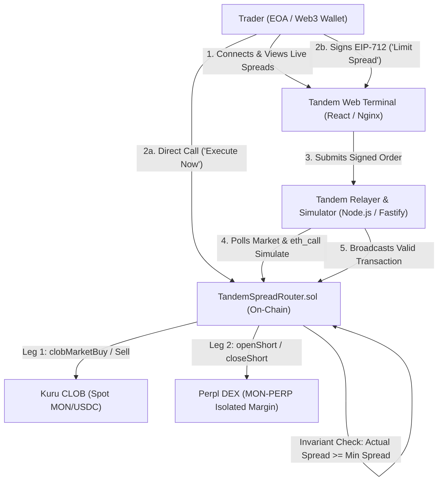

# Tandem Protocol Architecture & System Design

This document details the architectural design, component interactions, contract interfaces, and execution flows for the **Tandem Spread Orders** protocol on Monad.

---

## 1. High-Level System Overview

Tandem is an atomic multi-leg trade orchestration protocol built natively for the Monad blockchain. It couples two distinct DeFi trading venues into a unified, atomic execution primitive:
- **Kuru CLOB**: On-chain Central Limit Order Book for spot MON/USDC trading.
- **Perpl DEX**: Isolated margin decentralized exchange for MON-PERP perpetual futures trading.



---

## 2. Smart Contract Subsystem

All smart contracts reside in `src/` and are built and tested using Foundry.

```
src/
├── TandemSpreadRouter.sol     # Primary orchestrator & entry/exit executor
├── TandemOrder.sol            # EIP-712 hashing, signature verification, nonces
├── interfaces/
│   ├── ITandemSpreadRouter.sol# Router external interface
│   ├── IKuruOrderBook.sol     # Kuru CLOB interface
│   └── IPerplExchange.sol     # Perpl Perpetual Exchange interface
├── adapters/
│   ├── KuruAdapter.sol        # Venue adapter for Kuru CLOB
│   └── PerplAdapter.sol       # Venue adapter for Perpl DEX
└── libraries/
    └── SpreadMath.sol         # Integer math for spreads, prices & fees
```

### 2.1. `TandemSpreadRouter.sol`

The central router contract is stateless with respect to trader custody:
- **No Asset Custody**: Does not hold idle user funds. Quote tokens (USDC) and margin tokens (AUSD) are pulled directly from the trader via `transferFrom` at execution time and settled immediately.
- **Flash Accounting**: Measures initial contract and user balances before executing any leg, executes venue interactions, measures resulting balance deltas, and validates economic conditions.
- **Transaction Rollback Guarantee**: If any check fails (e.g. price impact, insufficient liquidity on either venue, or executed spread below `minSpread`), the contract reverts, ensuring EVM state rollback.

#### Core Entrypoint Methods

```solidity
function executeSpreadOrder(
    TandemOrder.SpreadOrder calldata order,
    bytes calldata signature
) external returns (uint256 spotReceived, uint256 perpShortPrice, int256 netSpread);

function closeSpreadOrder(
    TandemOrder.CloseOrder calldata order,
    bytes calldata signature
) external returns (uint256 spotProceeds, uint256 perpClosePrice, int256 netExitSpread);

function cancelSpreadOrder(uint256 nonce) external;
```

---

## 3. Venue Adapters

### 3.1. Kuru Adapter (`src/adapters/KuruAdapter.sol`)
Interacts with the Kuru Central Limit Order Book:
- **Spot Purchase (`buySpotMarket`)**: Executes `clobMarketBuy` against Kuru orderbook for MON/USDC. Converts native MON outputs to wrapped tokens if necessary, verifies output quantity against slippage limits, and calculates the effective purchase price.
- **Spot Sale (`sellSpotMarket`)**: Executes `clobMarketSell` on Kuru when closing the basis position, ensuring minimum quote token proceeds.

### 3.2. Perpl Adapter (`src/adapters/PerplAdapter.sol`)
Interacts with Perpl Perpetual Exchange:
- **Margin Isolation**: Deposits collateral (AUSD) into the trader's designated Perpl isolated margin subaccount.
- **Perp Short Entry (`openShortPosition`)**: Calls `openPosition` on the Perpl market proxy with negative size (short MON-PERP). Verifies execution price against `minPerpPrice`.
- **Perp Short Exit (`closeShortPosition`)**: Calls `closePosition` or offsets position lots to buy back the perpetual short during reverse flow execution.

---

## 4. Off-Chain Components

### 4.1. TypeScript SDK (`packages/sdk`)
Provides typed interfaces and signing helpers:
- `SpreadOrder` and `CloseOrder` interfaces matching Solidity definitions.
- EIP-712 domain setup for Monad Mainnet (`143`) and Monad Testnet (`10143`).
- `signSpreadOrder()` and `signCloseOrder()` with viem `WalletClient`.
- `hashSpreadOrder()` and `hashCloseOrder()` for deterministic order identification.

### 4.2. Executor Relayer Service (`services/executor`)
- Built with Fastify, viem, and TypeScript.
- **Market Polling**: Continuously queries Kuru best ask and Perpl mark price.
- **Simulation Engine**: Runs `eth_call` simulations for active orders in memory before spending gas on-chain.
- **Queue Management**: Safely tracks submitted orders, execution receipts, and transaction hashes.

### 4.3. Web Trading Terminal (`apps/web`)
- React 19 application with a dark-mode institutional trading interface.
- Real-time spread ticker, order creation forms ("Execute Now" vs "Limit Spread"), pending order queue, active position management card, and emergency direct on-chain controls.
- Served in production by Nginx with API reverse proxying to Fastify.
